## MICRO BLOG

## Home page
features nav bar with sign up and login button. gif embedded from giphy and brief desrciption of the site.
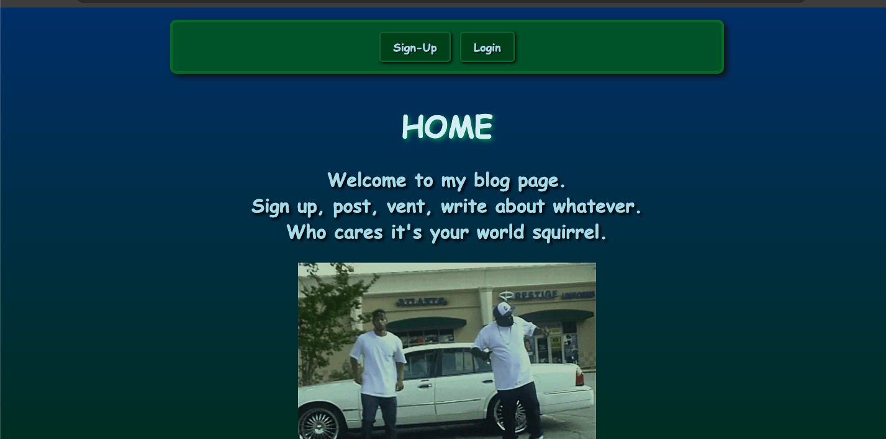

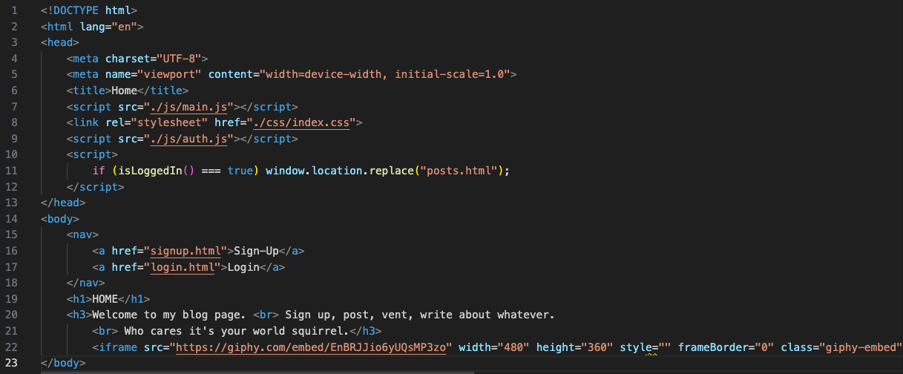

## SIGNUP
sign up page features html/css nav bar and input fields. Username, full name, and pw inputs with save button.
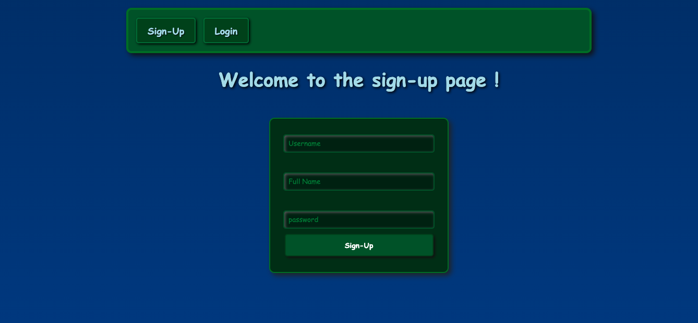

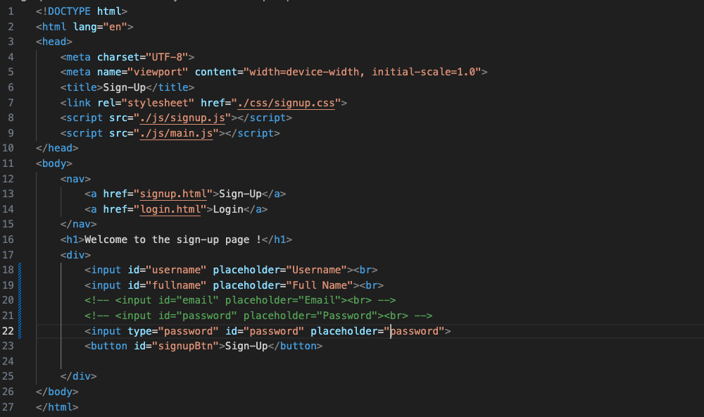

## LOGIN
login page has nav bar, username and password inputs. login button sends user to messages page.
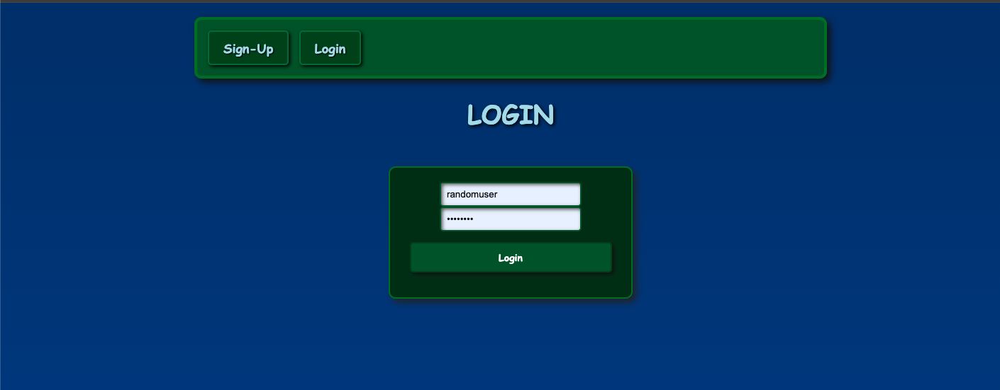

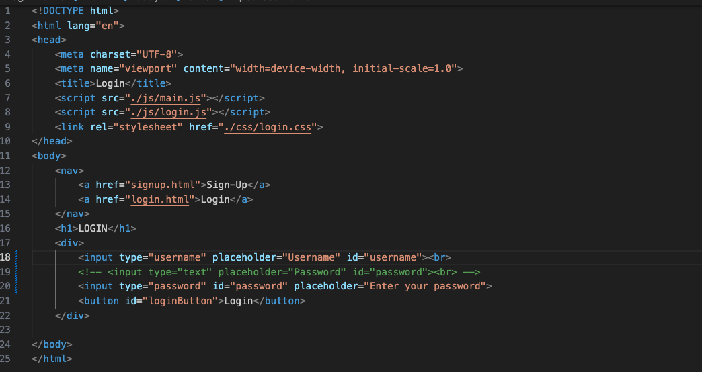

## MESSAGES
messages page displays all new and existing messages in real time. (Sort by box not fully functional)
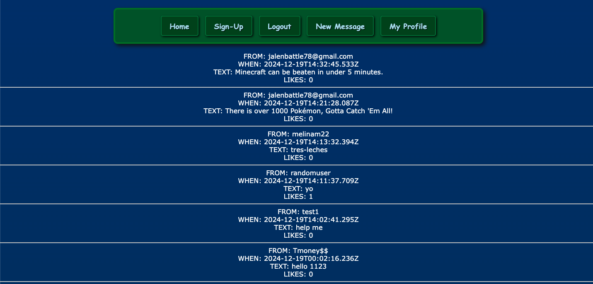

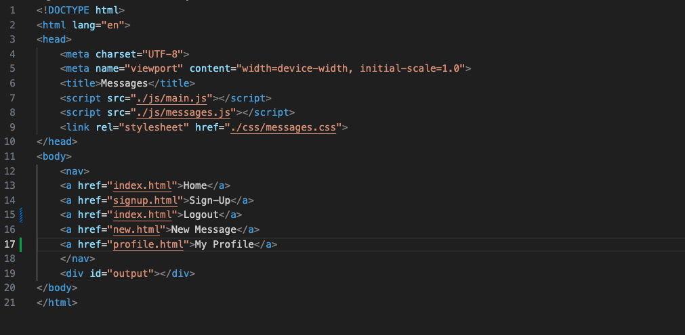

## NEW MESSAGES
new messages page features text box and submit button. nav bar features links to profile, messages, logout button.
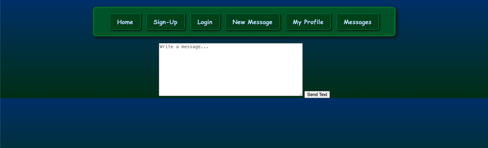

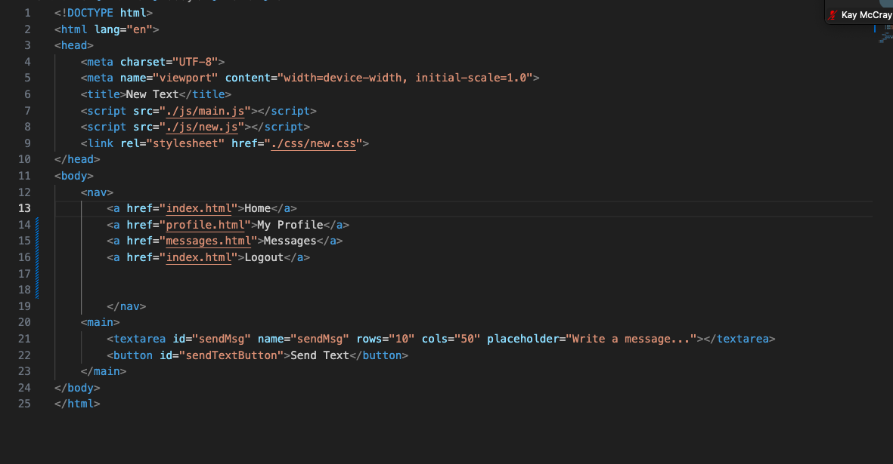

## PROFILE
profile features inputs to update username, full name, bio, and audio. 

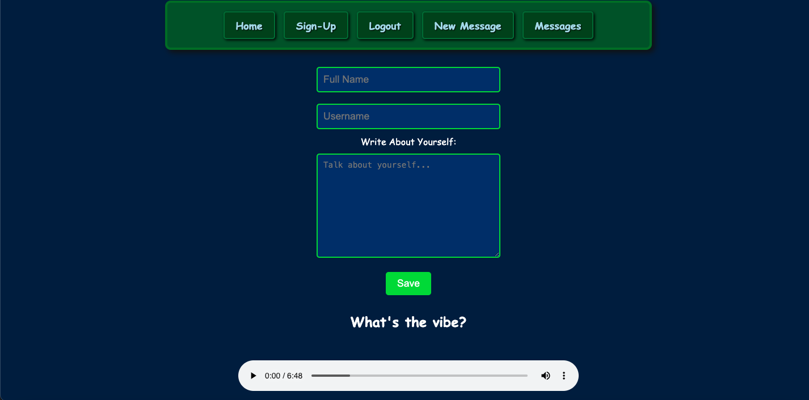

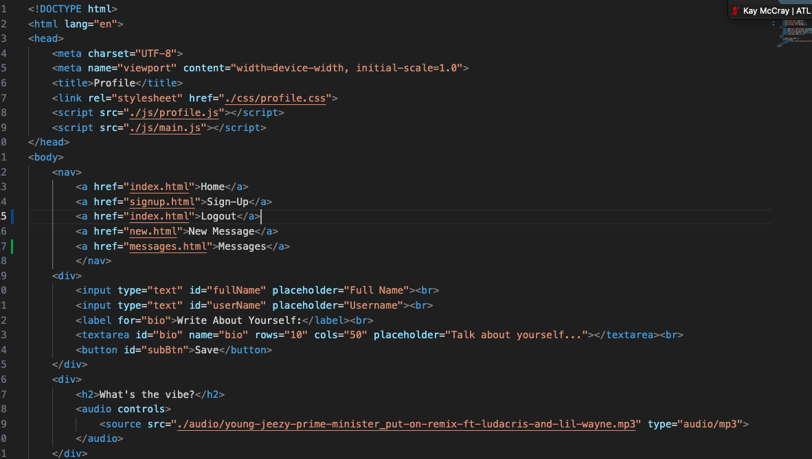

## CSS snippet
i used the keyframe in my CSS to create a strobe effect to match the theme througout the page 
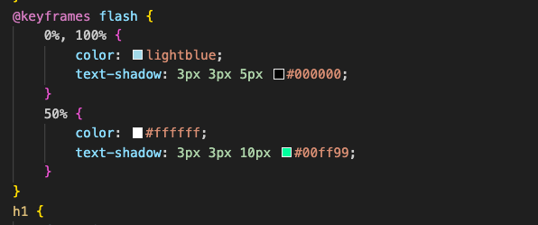

